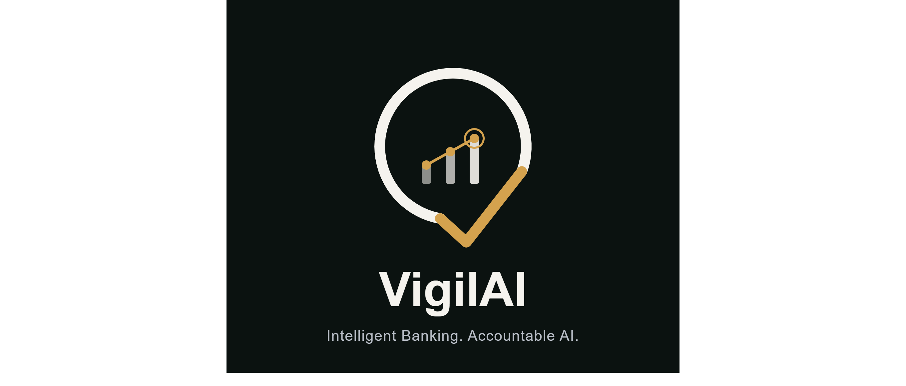

<div align="center">



### *Intelligent Banking. Accountable AI.*

</div>

---

## About VigilAI

**VigilAI** is an end-to-end, responsibly governed AI/ML/GenAI platform for Banking, Financial Services & Insurance (BFSI). It combines fraud and risk detection, a governed Retrieval-Augmented Generation (RAG) banking assistant, and a full AI governance layer — adversarial testing, model cards, an AI risk register, and drift monitoring — into a single, unified intelligence platform.

Most portfolio projects show a model. VigilAI shows a model **and the proof that it can be trusted** — treating explainability, security, and accountability as first-class deliverables, not an afterthought.

---

## What VigilAI Does

| Capability | Description |
|---|---|
| 🔍 **Fraud & Risk Detection** | Classical ML models (XGBoost, Random Forest) with SHAP explainability |
| 💬 **Governed Banking Assistant** | RAG chatbot over banking policy documents, running on local open-source LLMs |
| 🛡️ **AI Governance & Security** | Adversarial testing, prompt-injection testing, model cards, AI risk register |
| 📊 **BI Dashboards** | Power BI / Tableau dashboards for fraud trends, risk segments, and complaint themes |
| 🚀 **MLOps & Deployment** | Reproducible, containerized, one-click live demo |

---

## Architecture Overview

```
Layer 4 — BI Dashboards & Deployment
Layer 3 — AI Governance & Security   (the differentiator)
Layer 2 — ML & GenAI Models
Layer 1 — Data Foundation & Streaming
```

Data flows bottom-up: the data foundation feeds the ML/GenAI models, which are wrapped by governance controls, which in turn feed the BI and deployment layer.

---

## Project Status

🚧 **In active development** — MVP target: December 2026

| Module | Status |
|---|---|
| Data Foundation | ⏳ In Progress |
| Classical ML (Fraud/Risk) | ⏳ Planned |
| RAG Banking Assistant | ⏳ Planned |
| AI Governance & Security | ⏳ Planned |
| BI Dashboards | ⏳ Planned |
| Deployment | ⏳ Planned |

---

## Repository Structure

```
vigilai/
├── 01-data-foundation/
├── 02-classical-ml/
├── 03-deep-learning/
├── 04-genai-rag-agent/
├── 05-nlp-complaints/
├── 06-governance-security/
├── 07-bi-dashboards/
├── 08-mlops-deployment/
├── 09-multi-cloud-notes/
├── assets/
└── README.md
```

---

## Tech Stack

`PostgreSQL` `Docker` `Python` `scikit-learn` `XGBoost` `SHAP` `Ollama` `LangChain` `Chroma` `IBM ART` `Evidently AI` `Power BI` `MLflow` `Streamlit`

---

## Roadmap

- [ ] Data foundation: schema, sample data, migration & backup drill
- [ ] Fraud detection model with SHAP explainability
- [ ] RAG banking assistant
- [ ] Adversarial testing & AI risk register
- [ ] BI dashboard
- [ ] Live deployment demo

---

<div align="center">

**VigilAI** — built as a demonstration that intelligent banking systems can be predictive, explainable, and accountable at the same time.

</div>
